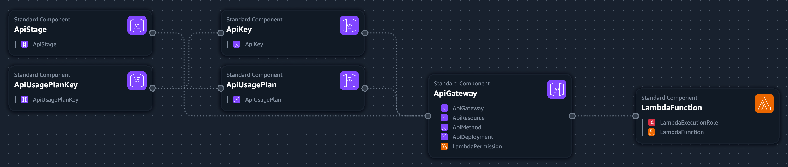
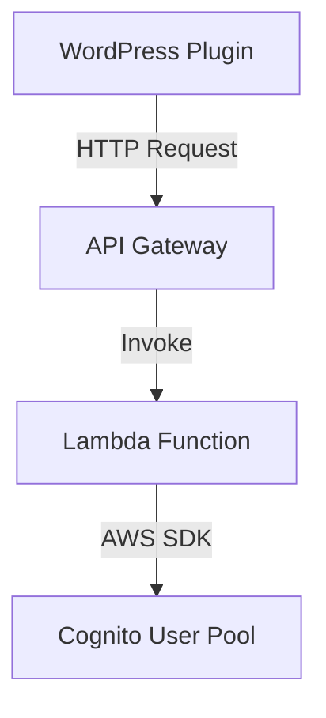
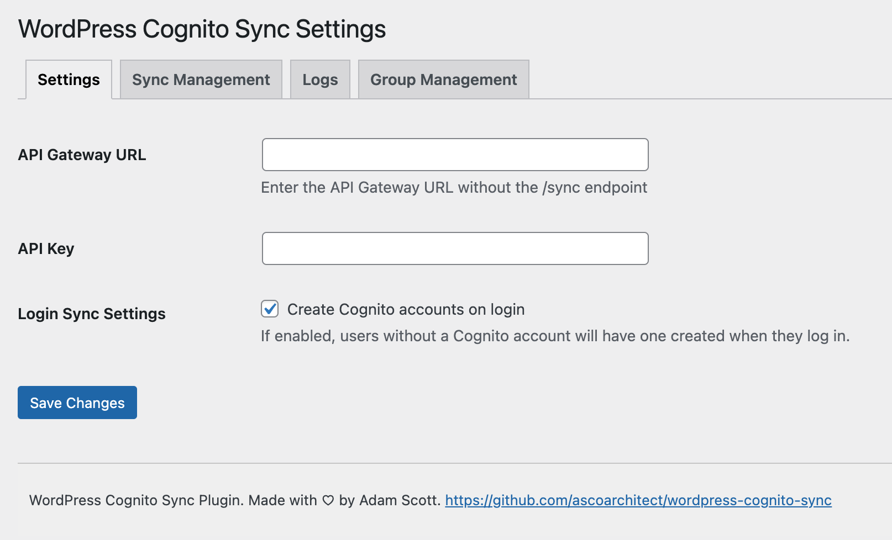

# WordPress Cognito Sync Plugin and AWS Integration
## Overview

The WordPress Cognito Sync plugin automatically synchronizes WordPress user and group operations with Amazon Cognito User Pools using AWS API Gateway and Lambda. It supports full and test synchronization options, detailed logs, and automatic account creation on user login.

Made with :heart: for the :earth_africa: by Adam Scott.

[](https://ko-fi.com/E1E3E8UBL)
<br/><a href="https://www.buymeacoffee.com/ascoarchitect" target="_blank"></a>

**Missing a feature? Submit your contributions to make this better for everyone!**

## Features

* Synchronize WordPress users with Amazon Cognito User Pools
* Synchronize WordPress roles with Amazon Cognito groups
* Automatically create Cognito accounts on user login
* Full and test synchronization options for users and groups
* Detailed logs and sync results

## Requirements

* WordPress 6.0 or higher
* PHP 7.2 or higher
* Developed on Wordpress 6.6.2 and PHP 8.2.26
* AWS account with existing Cognito User Pool and permissions to deploy API Gateway, IAM policies and Lambda Functions.

## Plugin Structure
```text
plugin/
    assets/
    includes/
        Admin.php
        API.php
        Plugin.php
        User.php
    readme.txt
    wp-cognito-sync.php
```

## Backend Infrastructure

The backend infrastructure is defined using AWS CloudFormation and includes the following components:

* Lambda Function: Handles user and group operations.
* API Gateway: Exposes the Lambda function as a REST API.
* IAM Roles: Provides necessary permissions for the Lambda function.

### CloudFormation Template

The CloudFormation template is located in cognito-sync-cloudformation.yaml. It defines the Lambda function, API Gateway, and IAM roles required for the plugin to communicate with AWS services.



### Data Flow Diagram


## WordPress Plugin Functionality
### Initialization
The plugin is initialized in wp-cognito-sync.php. It sets up the autoloading of classes and hooks into WordPress actions.

### Admin Interface
The admin interface is managed by the Admin class. It adds menu items, registers settings, and handles form submissions.



### Tabs

* Settings: Configure API Gateway URL and API key.
* Sync Management: Perform full or test synchronization of users and groups.
* Logs: View synchronization logs.
* Group Management: Manage synchronization of WordPress roles with Cognito groups.

### User Synchronization
The API class handles communication with the AWS Lambda function. It sends user and group data to the Lambda function for synchronization with Cognito.

### User Flow

* User logs in to WordPress.
* The User class checks if the user exists in Cognito.
* If not, the user is created in Cognito.
* User data is synchronized with Cognito.

### Group Synchronization
The plugin synchronizes WordPress roles with Cognito groups. The Admin class manages the group synchronization settings and actions.

### Deployment
#### Prerequisites

* AWS CLI configured with appropriate permissions.
* AWS CloudFormation template (infrastructure/cognito-sync-cloudformation.yaml).

#### Steps
* Deploy the CloudFormation stack:

```bash
aws cloudformation deploy --template-file infrastructure/cognito-sync-cloudformation.yaml --stack-name wp-cognito-sync --parameter-overrides Environment=prod CognitoUserPoolId=xx-xxxx-x_xxxxxxxx
```

Note the API Gateway endpoint URL and API key from the CloudFormation stack outputs.

### Installation

* Upload the plugin files to the /wp-content/plugins/wp-cognito-sync directory, or install the plugin through the WordPress plugins screen directly.
* Activate the plugin through the 'Plugins' screen in WordPress.
* Use the Settings->Cognito Sync screen to configure the plugin with your API Gateway URL and API key.

### Conclusion

The WordPress Cognito Sync plugin provides seamless synchronization between WordPress and Amazon Cognito User Pools. By leveraging AWS Lambda and API Gateway, it ensures that user and group data is consistently synchronized, providing a robust solution for managing user authentication and authorization.

**This plugin is provided "as is" without any guarantees or warranty. In association with the product, the author makes no warranties of any kind, either express or implied, including but not limited to warranties of merchantability, fitness for a particular purpose, of title, or of non-infringement of third-party rights. Use of the product by a user is at the user’s risk.**
